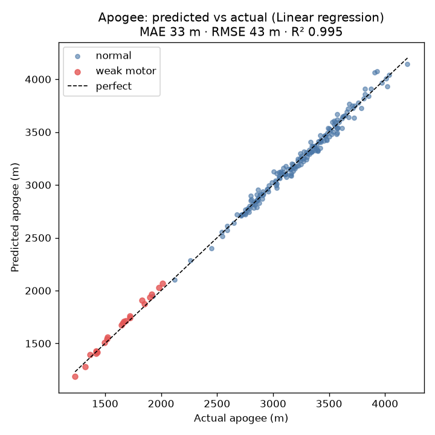
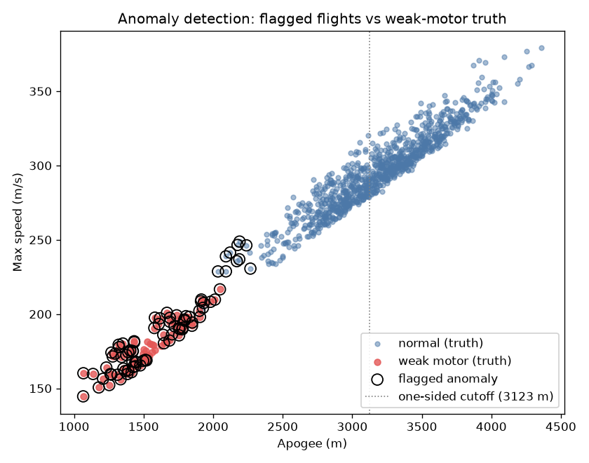

# Rocket Flight Planner & Analytics Platform

[](https://github.com/aaditya4401-dot/launchloop/actions/workflows/ci.yml)

> Generate realistic rocket-flight data with a physics simulator, turn it into clean
> queryable tables, learn from it with ML, and let a team of AI agents **design** a
> flight that meets its mission — verifying every decision against the simulator.

I built this as an end-to-end system that spans three domains I work across —
**data engineering**, **data science**, and **agentic AI** — on a single self-generated
dataset, so every layer feeds the next:

| Layer | What it does | Command |
|---|---|---|
| **Simulate → store** | Generates 1,000 physics-sim flights and lands them in a queryable warehouse | `make data` |
| **Predict → detect** | Predicts apogee from the first 2 s of flight and flags sabotaged motors | `make models` |
| **Design → verify** | An agent team designs a flight and verifies it against the simulator | `make design` |

Everything runs on a laptop with **zero downloaded data** — every flight comes from the
[RocketPy](https://github.com/RocketPy-Team/RocketPy) physics simulator, so I own the whole
pipeline end to end. The only outbound network calls are the LLM API in Phase 3.

---

## The pipeline

```
RocketPy simulation  (1,000 flights: random wind / motor strength / mass)
      ▼
Parquet files in data/raw/         ← one file per flight, full time-series
      ▼
DuckDB + dbt                       ← clean + combine → one row per flight
      ├───────────────► scikit-learn models   (predict apogee, detect anomalies)
      ▼                        │
LangGraph agent team ──► propose config ──► RocketPy verifies it (the oracle)
      ▲                                            │
      └──────────── adjust & re-simulate ◄─────────┘   (loop, capped iterations)
      ▼
Verified flight design (go / no-go with reasons)
```

The final arrow **loops back**: agents propose, the simulator judges, agents correct —
constraint satisfaction against ground truth, not one-shot report generation.

---

## Quickstart

Requires [`uv`](https://docs.astral.sh/uv/) (installs Python 3.13 + all deps):

```bash
uv sync                 # create .venv on Python 3.13, install everything
make test               # run the test suite (~7s, no data or API keys needed)

make simulate           # Phase 1: fly 1,000 rockets -> data/raw/*.parquet  (~6 min)
make data               # Phase 1: load into DuckDB + build the dbt summary table
make models             # Phase 2: train apogee prediction + anomaly detection
make design             # Phase 3: run the closed-loop designer (needs an LLM key, below)
```

`make help` lists everything. `make dispersion` runs RocketPy's native Monte Carlo as a
standalone study.

---

## Phase 1 — Generate & store the data (data engineering)

A Monte Carlo loop flies one solid-motor rocket **1,000 times**, randomizing per flight:

- **Wind** — direction `θ ~ U(0, 2π)`, magnitude `~ U(0, 20)` m/s (drawn as magnitude +
  direction so total wind stays bounded).
- **Mass** — 14.4 kg ± 5% (normal); **motor strength** — thrust curve scaled ± 8% (normal).
- **~10% sabotaged** — motor thrust cut to 55–70% (low total impulse). These are labeled
  `is_weak_motor = true` — the **answer key** for Phase 2.

Each flight's altitude / vertical-velocity / acceleration time-series is saved as a
Parquet file. A pipeline step loads all 1,000 into **DuckDB**, and **4 small dbt models**
(`stg_traces`, `stg_labels`, `flight_metrics`, `flight_summary`) clean and combine them
into one row per flight — apogee, max speed, and label.

**Result:** 1,000 flights (92 weak = 9.2%), ~1.1M trace rows → one queryable
`flight_summary` table. dbt re-derives apogee from the raw traces and it matches RocketPy's
reported apogee to within rounding (a built-in data-quality check). `make data` rebuilds
the whole warehouse from scratch and dbt's tests pass.

```sql
-- one row per flight, straight from the warehouse
SELECT is_weak_motor, COUNT(*), ROUND(AVG(apogee_m)) AS avg_apogee
FROM flight_summary GROUP BY is_weak_motor;
--  false | 908 | 3188   (normal)
--  true  |  92 | 1549   (weak — and their apogee ranges OVERLAP the normal ones)
```

---

## Phase 2 — Learn from the data (data science)

Two scikit-learn models, built on features extracted with DuckDB.

### Apogee prediction (regression)

Using **only the first 2 seconds** of each flight (well before the 3.9 s burnout and the
~25 s apogee), predict the *final* apogee. Physically motivated features: peak velocity,
peak & mean acceleration (thrust-to-weight), altitude reached.

| Model | MAE | RMSE | R² |
|---|---|---|---|
| Baseline (guess the mean) | 464 m | 622 m | ~0 |
| **Linear regression** | **33 m** | **43 m** | **0.995** |
| Random forest | 45 m | 60 m | 0.991 |

**33 m average error on ~3,000 m apogees (~1%), 93% better than guessing the mean** — from
2 seconds of flight. The *simple* model wins, because apogee is genuinely near-linear in
early kinetic energy; the forest just adds noise on a smooth surface.



### Anomaly detection (unsupervised)

An `IsolationForest` flags "bad" flights from **observed telemetry only** (apogee, max
speed, rail-exit velocity, time-to-apogee) — deliberately *not* the ground-truth motor
knob, which would leak the answer. It's scored blind against the weak-motor labels.

A sabotaged motor can only *underperform*, so we keep only underperformance-side anomalies
(the detector otherwise flags both tails). Result:

**Precision 0.87 · Recall 0.77 · F1 0.82** — caught **71 of 92** sabotaged motors, 11 false
alarms. Not perfect on purpose: the weak/normal apogee ranges overlap, so this is real
detection, not trivial thresholding.



Charts land in [`notebooks/`](notebooks/).

---

## Phase 3 — Closed-loop flight designer (multi-agent AI)

Not a report-writer. Given a **mission** — target apogee, a hard waiver ceiling, the day's
wind, and a short menu of motors — a [LangGraph](https://github.com/langchain-ai/langgraph)
team **designs** a flyable rocket: it proposes a configuration, simulates it in RocketPy,
and iterates until every constraint is met, or declares a justified no-go.

**Why the multi-agent structure is load-bearing** — the specialists hold *competing*
objectives, so the orchestrator arbitrates a real tradeoff:

- **Performance** — wants apogee on target (bigger motor, less ballast)
- **Safety** — wants apogee under the ceiling + stability/rail-exit in band (smaller motor,
  more ballast) — *directly fights performance*
- **Recovery** — wants landing dispersion contained (parachute sizing)
- **Orchestrator** — proposes the next change, breaks ties, calls go / no-go

**RocketPy is the oracle:** no metric is ever accepted unless a real simulation produced
it. A cheap **ML pre-screen** (the Phase 2 apogee model on a 2-second sim) *ranks* candidate
motors so the agents try the promising one first — but it's ranking-only, flags proposals
outside its training envelope as unreliable, and the full sim always makes the final call.

### Sample run

The mission starts on the **biggest motor (9,000 N·s → 5,022 m)**, which blows the 3,200 m
ceiling — so the agents must actually work. Target 3,000 m.

```
[iter 1] M2310 → apogee 5022 m  [VIOLATION: over ceiling]
   [performance ✗] apogee far above target → wants a lower-impulse motor (M1920)
   [safety      ✗] apogee exceeds the ceiling → wants the smallest motor (L900)
   [recovery    ✗] dispersion too large from the excess altitude → wants L900
   [pre-screen]  M1540 ~3010 m (in-envelope) · M2310 ~4973 m (OUT-of-envelope ⚠)
   → orchestrator: specialists split on how far to cut; the pre-screen says M1540 is
     closest to target — try it. (jumps straight past M1920)

[iter 2] M1540 → apogee 2999 m  [OK]  stability 2.19 cal · rail-exit 30.8 m/s
   [performance ✓] [safety ✓] [recovery ✓]
   → orchestrator: GO — all hard constraints pass, apogee within 1 m of target.

VERDICT: GO   M1540 | 0 kg ballast | rail 85° | apogee 2999 m   (2 / 8 sims)
```

The specialists genuinely disagreed on the fix (performance→M1920, safety→L900); the
orchestrator arbitrated and — guided by the pre-screen ranking — jumped directly to the
sweet-spot motor, reaching a verified GO in **2 iterations** instead of blindly stepping
down. Landing **1 m from target**, under the ceiling, stable.

### Running it

The agent backend is provider-swappable. Set the key for whichever you have:

```bash
export OPENAI_API_KEY=sk-...            # default backend (gpt-4o)
make design                            # OpenAI agents + ML pre-screen

make design BRAIN=claude               # Anthropic backend (needs ANTHROPIC_API_KEY)
make design BRAIN=stub                 # deterministic policy, fully offline (no key)

# override the mission (any subset; unset ones keep the default)
make design TARGET=4000 CEILING=4500 WIND=3
```

The `stub` brain runs the identical LangGraph — useful for testing the loop mechanics
without any API calls.

---

## Repo layout

```
src/
├── simulate/    RocketPy: one rocket (rocket.py), the Monte Carlo loop (run.py),
│                trace extraction (trace.py), native dispersion study (dispersion.py)
├── pipeline/    load Parquet traces into DuckDB (load.py)
├── dbt/         4 SQL models: stg_traces, stg_labels, flight_metrics, flight_summary
├── analysis/    features.py, apogee_model.py, anomaly_model.py
├── agents/      oracle.py (evaluate→metrics), mission.py, constraints.py,
│                brain.py + {openai,claude}_brain.py (swappable) + agent_prompts.py,
│                prescreen.py (ML pre-screen), designer.py (the LangGraph loop)
└── demo/        Streamlit UI (app.py), event streaming (events.py), replay recorder (record.py)
tests/       pytest suite — oracle physics, constraints, mission, brain, features (27 tests, ~7s)
data/        raw/ per-flight Parquet · warehouse.duckdb · labels.parquet
notebooks/   README charts
```

---

## Tech stack

**Python 3.13** · **RocketPy** (flight sim + oracle) · **Parquet / DuckDB / dbt** (storage +
transforms) · **polars** (dataframes) · **scikit-learn** (ML) · **LangGraph** (agent graph)
· **OpenAI / Anthropic** (agent reasoning) · **Typer + Make** (one-word commands) · **uv**
(Python + deps).

## Engineering decisions & tradeoffs

I made these calls deliberately — surfacing them is part of owning the system:

- **Fully offline** except the Phase 3 LLM calls: weather is a self-defined
  `custom_atmosphere`, and the motor thrust curve + drag are defined inline (RocketPy's
  PyPI wheel doesn't bundle its example data files).
- **RocketPy 1.12.1** — the API was verified against the installed version, not assumed
  (its Monte Carlo / Stochastic module is still evolving).
- **Reproducible** — every flight is seeded `base_seed + flight_id`, so any single flight
  regenerates on its own.
- **Modeling limitation:** the motor menu scales one thrust curve, which keeps propellant
  mass fixed — so stability margin is independent of motor choice here. The live
  performance↔safety tension comes from ballast (which moves both apogee and stability).
- The weak-motor sabotage band (55–70%) is intentionally easy to detect for now; tightening
  it toward 75–85% would make Phase 2 less trivial.
